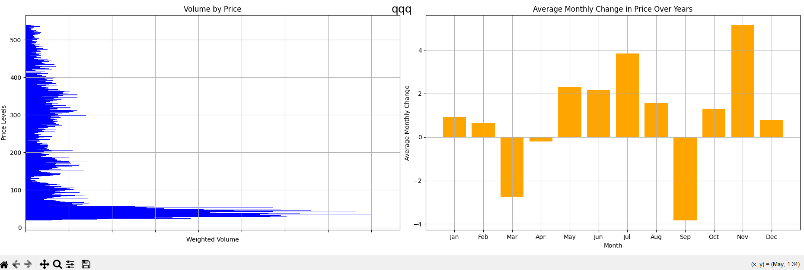

# volume-by-price
Python Script to find Volume by Price for an asset




### Getting Started

This script uses the `requests` and `matplotlib`, please make sure to install these librares with `pip` before runnig the script

```
pip install requests
```
and
```
pip install matplotlib
```

The script requres 2 start up arguments

```[SYMBOL] [API KEY FROM ALPHA VANTAGE]```
The first argument is the symbol to analyze: TSLA, AAPL, MSFT etc. The second argument is the Api Key that you can get from https://www.alphavantage.co/ for free.

Run the script by executing the above command in bash (make sure to use your api key)

```python stock_data.py AAPL 21321asdavvv```