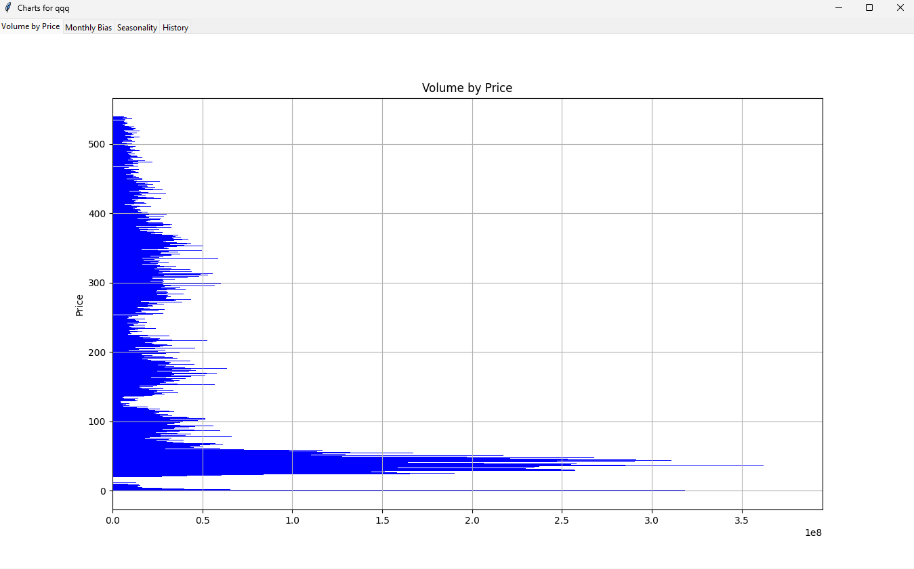
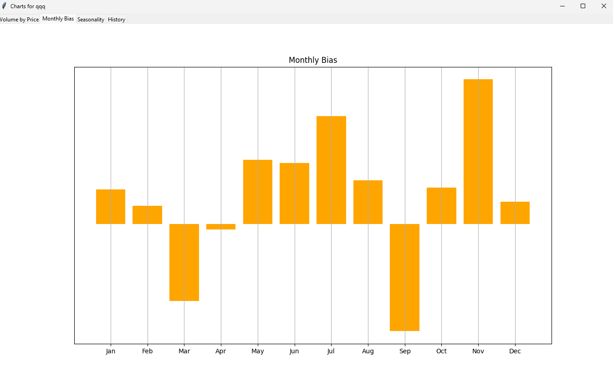
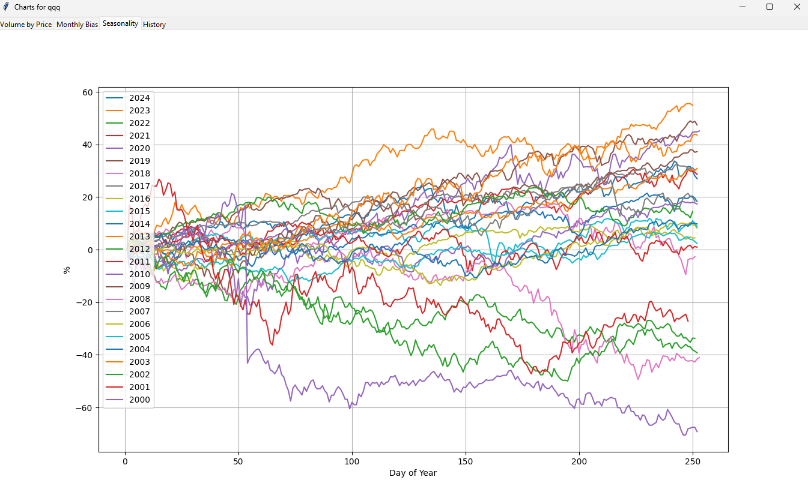
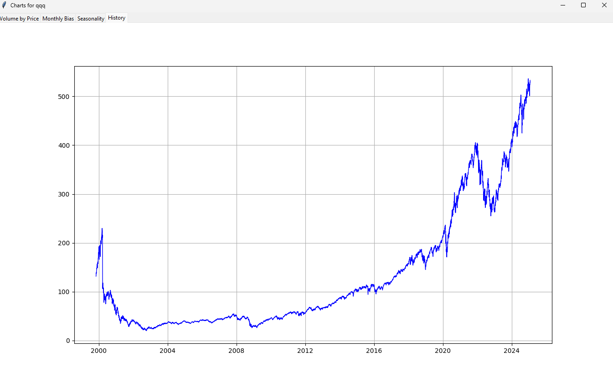

# volume-by-price
Python Script to Analyze Stock Data

This script calculates and visualizes Volume by Price for a given asset, allowing users to identify price levels by volume.
Additionally, it computes and plots the average monthly percentage change in price over the years.

Volume by Price              |  Monthly Bias
:-------------------------:|:-------------------------:
  |  


Seasonality              |  History
:-------------------------:|:-------------------------:
  | 


### Getting Started

This script uses the `requests`, `matplotlib`, `pandas`, and, `tkinter`, please make sure to install these librares with `pip` before running the script

```
pip install requests
```
```
pip install matplotlib
```
```
pip install pandas
```
```
pip install python-tk
```


### How to run
There are 2 ways to use the script, one is for stocks and equities another for crypto. 

To fetch data for stocks you must locate the file ```avkey.txt``` and add a API key that you can get from https://www.alphavantage.co/ for free.

#### 1 Alpha Vantage
```python vp.py [ASSET NAME] a```

This will make the script fetch data from AlphaVantage using the API key that is saved in ```avkey.txt```

 ```python vp.py AAPL a```

#### 2 Crypto
```python vp.py [ASSET NAME] c```

This will fetch data for a crypto currency from https://www.cryptodatadownload.com


Example : ```python vp.py BTC c```
