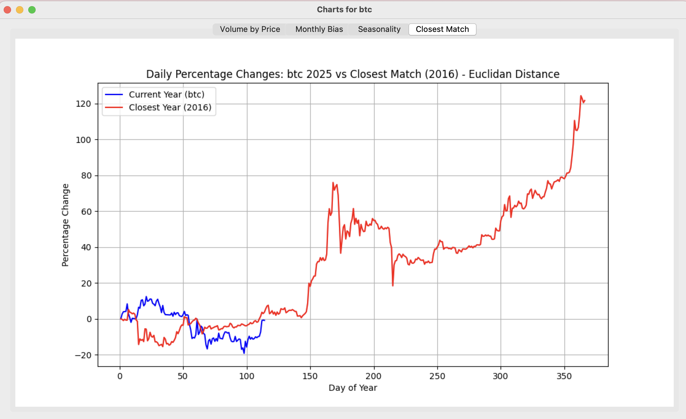

# 📈 Volume by Price & Seasonality Analyzer

A Python toolkit to visualize and analyze volume-by-price, monthly trends, and seasonal behavior in financial markets — supporting both crypto and stock assets. Spot patterns, compare years, and uncover potential seasonality using Euclidean Distance and Pearson Correlation.

> ⚡ Built for personal research, exploration, and financial curiosity.

---

## ✨ Features

- 🔄 **Support for Crypto & Stocks**  
  Fetches data from Alpha Vantage (stocks) or CryptoDataDownload (crypto).

- 📊 **Volume by Price Distribution**  
  Weighted volume aggregation based on Open, High, Low, and Close.

- 📅 **Monthly Bias Analysis**  
  Detects average gains/losses for each month across years.

- 📈 **Daily Percentage Change Seasonality**  
  Calculates and plots daily price performance year-over-year.

- 🧠 **Yearly Pattern Matching**  
  Finds closest historical year to the current one using:
  - Euclidean Distance
  - Pearson Correlation

- 🎨 **Clean Tkinter GUI + Matplotlib Charts**  
  All visualizations displayed in a lightweight multi-tab window.

---
## Preview
| Volume by Price | Monthly Bias | Closest Match |
| :---:   | :---: | :---: |
|  |  |  

---

## 🧪 Installation

Clone this repository:

```
git clone https://github.com/bardurt/volume-by-price.git
cd volume-by-price
```

Install Dependencies
```
pip install -r requirements.txt
```

## Usage
```
python vp.py <symbol> <asset_type> [method]
```


**Arguments:**

**symbol**: e.g. BTC, AAPL

**asset_type**: use c for crypto, anything else for stocks

**method**: optional; euclidean (default) or pearson

**Examples:**

```
python vp.py BTC c

python vp.py AAPL s pearson
```

### Note

If using this script for stocks, make sure to get a free api key from Alpha Vantage, https://www.alphavantage.co/, and add the key to the file `config/awkey.txt`

---
### 🧠 How It Works
Fetches historical OHLCV data.

Processes volume distribution with customizable weights.

Aggregates monthly and daily percentage changes.

Compares current year's daily performance with historical years.

Visualizes insights in a Tkinter dashboard.

### 📜 License
MIT License. Feel free to fork, modify, and experiment!

## Author
Built by @bardurt
For questions, drop an issue or connect on X/Twitter!
