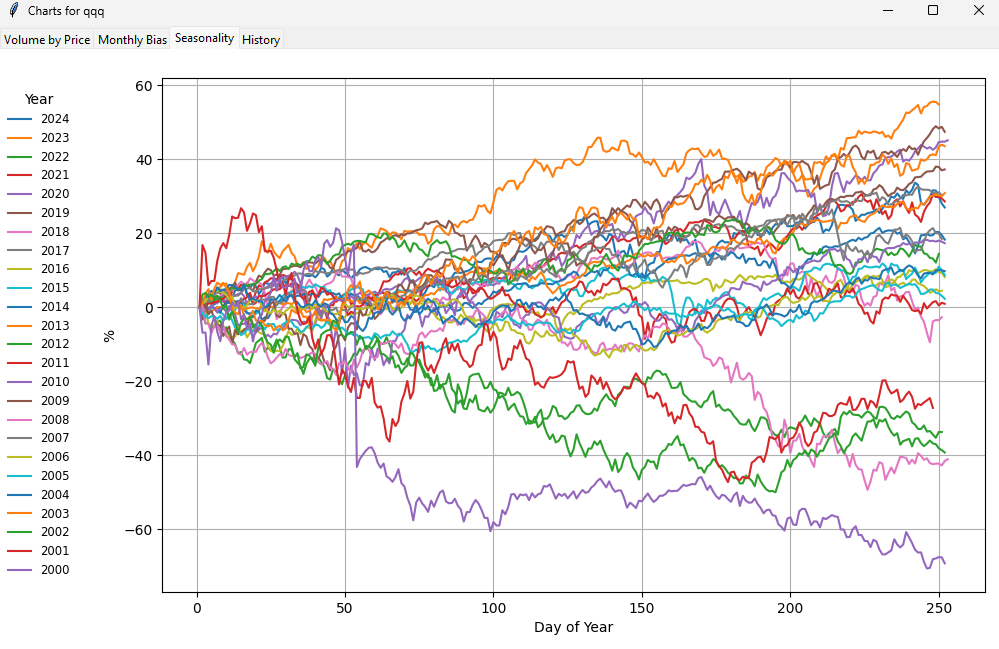

# volume-by-price
Python Script to Analyze Stock Data

This script calculates and visualizes Volume by Price for a given asset, allowing users to identify price levels by volume.
Additionally, it computes and plots the average monthly percentage change in price over the years.

Volume by Price              |  Monthly Bias
:-------------------------:|:-------------------------:
  |  


Seasonality              |  History
:-------------------------:|:-------------------------:
  | 


### Getting Started

This script uses the `requests` and `matplotlib`, and, `pandas`, please make sure to install these librares with `pip` before running the script

```
pip install requests
```
and
```
pip install matplotlib
```
and
```
pip install pandas
```

### How to run
There are 2 ways to use the script, if only 1 argument is given then the script will assume that the symbol is a crypto currency.

#### 1 Alpha Vantage
```python vp.py [ASSET NAME] [API KEY FROM ALPHAVANTAGE]```

The first argument is the symbol to analyze: TSLA, AAPL, MSFT etc. The second argument is the Api Key that you can get from https://www.alphavantage.co/ for free.

Example (make sure to use your api key, the one in the sample is not real):

 ```python vp.py AAPL 21321asdavvv```

#### 2 Crypto
```python vp.py [ASSET NAME] ```

This will fetch data for a crypto currency from https://www.cryptodatadownload.com


Example : ```python vp.py BTC```
